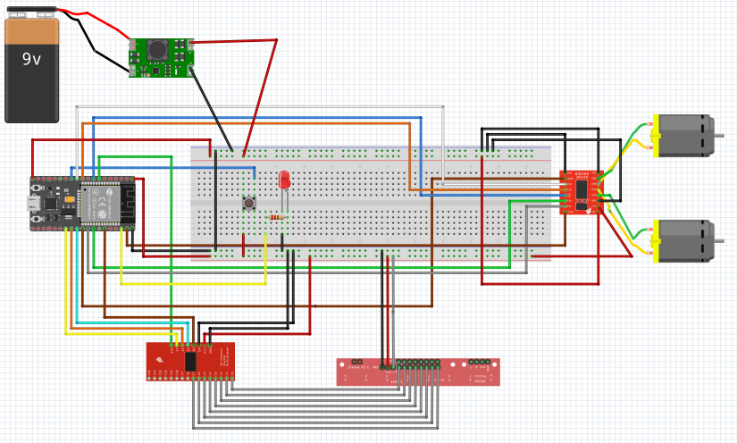
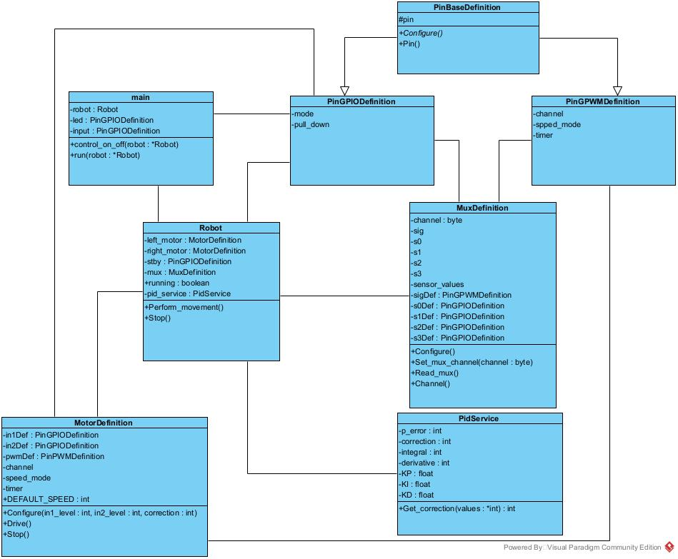

# Project of Line-follower Robot
## Technologies
- ESP32 with ESP-IDF framework
- C++
- Platformio

### Demo
https://github.com/user-attachments/assets/93ca8dd1-7277-4c8a-af10-bb13ea7095ad

### Schema

### Class diagram

Guided by:
https://github.com/LaboratorioGluon
